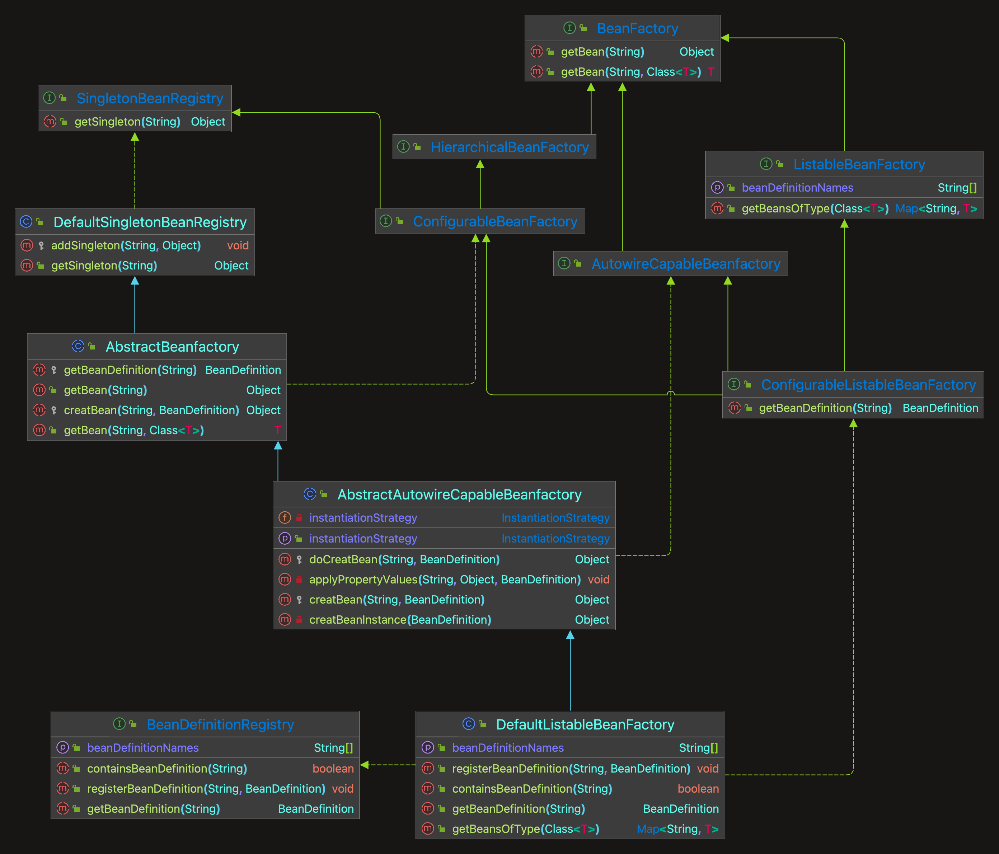
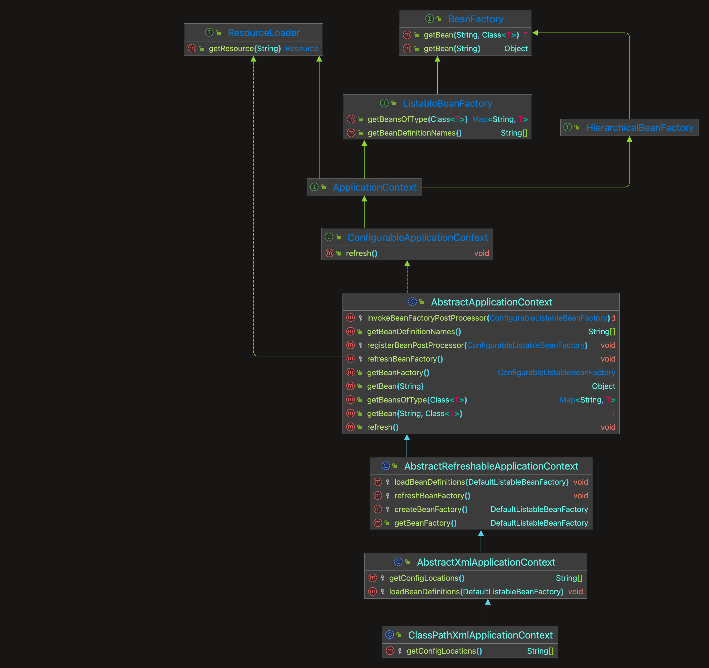

# mono-spring
参考mini-spring， 实现最简单的spring功能

## [为bean填充属性](#为bean填充属性)
> 代码分支：populate-bean-with-property-values

在BeanDefinition中增加和bean属性对应的PropertyValues，实例化bean之后，为bean填充属性(AbstractAutowireCapableBeanFactory#applyPropertyValues)。

> Tip: JavaBean在申明有参构造后无参构造会被覆盖,需要显示申明无参构造,否则在
> 通过'getDeclaredConstructor()' 获取构造器会报错 'NoSuchMethodException'


## [资源和资源加载器](#资源和资源加载器)
> 代码分支：resource-and-resource-loader
Resource是资源的抽象和访问接口，简单写了三个实现类
- FileSystemResource，文件系统资源的实现类
- ClassPathResource，classpath下资源的实现类
- UrlResource，对java.net.URL进行资源定位的实现类

默认策略:
```java
public Resource getResource(String location) {
        if (location.startsWith(CLASSPATH_URL_PREFIX)) {
            // classpath下的资源
            return new ClassPathResource(location.substring(CLASSPATH_URL_PREFIX.length()));
        } else {
            try {
                // 尝试当成url处理
                URL url = new URL(location);
                return new UrlResource(url);
            } catch (MalformedURLException e) {
                // FileSystem处理
                return new FileSystemResource(location);
            }
        }
    }
```
## [在XML文件中定义Bean](#在XML文件中定义Bean)
> 代码分支：xml-file-define-bean

- 由于从xml文件中读取的内容是String类型，所以属性仅支持String类型和引用其他Bean。
```java
// String
String valueAttribute = property.getAttribute(VALUE_ATTRIBUTE);
//  引用类型
if (StrUtil.isNotEmpty(refAttribute)) {
    value = new BeanReference(refAttribute);
}
```
- BeanDefinitionReader是读取bean定义信息的抽象接口，XmlBeanDefinitionReader是从xml文件中读取的实现类。
- BeanDefinitionReader需要有获取资源的能力，且读取bean定义信息后需要往容器中注册BeanDefinition，因此BeanDefinitionReader的抽象实现类AbstractBeanDefinitionReader拥有ResourceLoader和BeanDefinitionRegistry两个属性。


测试:
```xml
<?xml version="1.0" encoding="UTF-8"?>
<beans xmlns="http://www.springframework.org/schema/beans"
       xmlns:xsi="http://www.w3.org/2001/XMLSchema-instance"
       xmlns:context="http://www.springframework.org/schema/context"
       xsi:schemaLocation="http://www.springframework.org/schema/beans
	         http://www.springframework.org/schema/beans/spring-beans.xsd
		 http://www.springframework.org/schema/context
		 http://www.springframework.org/schema/context/spring-context-4.0.xsd">

    <bean id="person" class="org.springframework.test.ioc.bean.Person">
        <property name="name" value="derek"/>
        <property name="car" ref="car"/>
    </bean>

    <bean id="car" class="org.springframework.test.ioc.bean.Car">
        <property name="brand" value="porsche"/>
    </bean>

</beans>
```

## [应用上下文ApplicationContext](#应用上下文ApplicationContext)
> 代码分支：application-context

- BeanFactory是spring的基础设施，面向spring本身
- 而ApplicationContext面向spring的使用者，应用场合使用ApplicationContext。

```java
public void refresh() throws BeansException {
        // 1. 创建BeanFactory,加载BeanDefinition
        refreshBeanFactory();
        // 1.2 获取beanFactory
        ConfigurableListableBeanFactory beanFactory = getBeanFactory();

        // 2. 实例化前执行BeanFactoryPostProcessor
        invokeBeanFactoryPostProcessor(beanFactory);

        // 3. 实例化前注册BeanPostProcessor
        registerBeanPostProcessor(beanFactory);

        // 4. 提前实例化单例Bean
        beanFactory.preInstantiateSingletons();
    }
```

