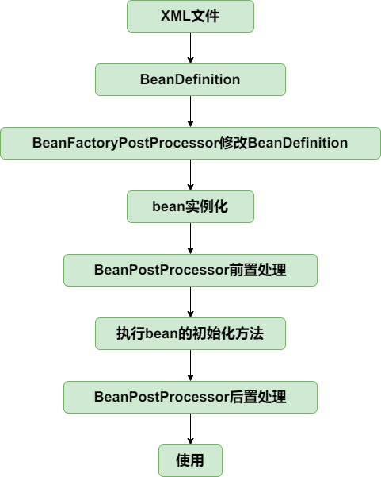
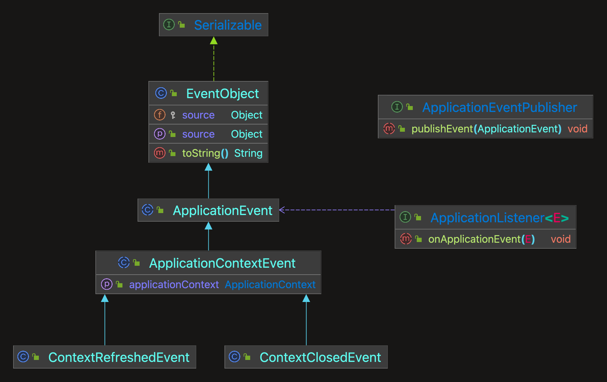
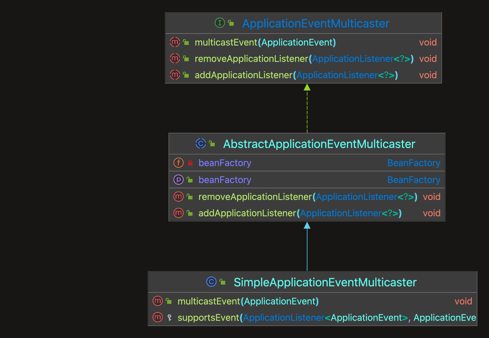

# mono-spring
参考[mini-spring](https://github.com/DerekYRC/mini-spring)， 实现最简单的spring功能
## 功能
### IOC
- [x] [实现一个简单容器](#实现一个简单容器)
- [x] [BeanDefinition & BeanDefinitionRegistry]()
- [x] [Bean实例化策略]()
- [x] [为bean填充属性](#为bean填充属性)
- [x] [资源和资源加载器](#资源和资源加载器)
- [x] [在xml文件中定义bean](#在xml文件中定义bean)
- [x] [容器扩展机制BeanFactoryPostProcess和BeanPostProcessor]()
- [x] [应用上下文ApplicationContext](#应用上下文applicationcontext)
- [x] [bean的初始化和销毁方法](#bean的初始化和销毁方法)
- [x] [Aware接口](#Aware接口)
- [x] [prototype支持](#prototype支持)
- [x] [FactoryBean](#FactoryBean)
- [x] [容器事件和事件监听器](#容器事件和事件监听器)
### AOP
- [ ] [切点表达式]
- [ ] [基于JDK的动态代理]
- [ ] [基于CGLIB的动态代理]
- [ ] [AOP代理工厂ProxyFactory]
- [ ] [几种常用的Advice: BeforeAdvice/AfterAdvice/AfterReturningAdvice/ThrowsAdvice]
- [ ] [PointcutAdvisor：Pointcut和Advice的组合]
- [ ] [动态代理融入bean生命周期]

### 扩展篇
- [ ] [PropertyPlaceholderConfigurer]
- [ ] [包扫描]
- [ ] [@Value注解]
- [ ] [基于注解@Autowired的依赖注入]
- [ ] [类型转换 I]
- [ ] [类型转换 II]
 
### [为bean填充属性](#为bean填充属性)
> 代码分支：populate-bean-with-property-values

在BeanDefinition中增加和bean属性对应的PropertyValues，实例化bean之后，为bean填充属性(AbstractAutowireCapableBeanFactory#applyPropertyValues)。

> Tip: JavaBean在申明有参构造后无参构造会被覆盖,需要显示申明无参构造,否则在
> 通过'getDeclaredConstructor()' 获取构造器会报错 'NoSuchMethodException'


### [资源和资源加载器](#资源和资源加载器)
> 代码分支：resource-and-resource-loader
Resource是资源的抽象和访问接口，简单写了三个实现类
- FileSystemResource，文件系统资源的实现类
- ClassPathResource，classpath下资源的实现类
- UrlResource，对java.net.URL进行资源定位的实现类

默认策略:
```java
public Resource getResource(String location) {
        if (location.startsWith(CLASSPATH_URL_PREFIX)) {
            // classpath下的资源
            return new ClassPathResource(location.substring(CLASSPATH_URL_PREFIX.length()));
        } else {
            try {
                // 尝试当成url处理
                URL url = new URL(location);
                return new UrlResource(url);
            } catch (MalformedURLException e) {
                // FileSystem处理
                return new FileSystemResource(location);
            }
        }
    }
```
### [在XML文件中定义Bean](#在XML文件中定义Bean)
> 代码分支：xml-file-define-bean

- 由于从xml文件中读取的内容是String类型，所以属性仅支持String类型和引用其他Bean。
```java
// String
String valueAttribute = property.getAttribute(VALUE_ATTRIBUTE);
//  引用类型
if (StrUtil.isNotEmpty(refAttribute)) {
    value = new BeanReference(refAttribute);
}
```
- BeanDefinitionReader是读取bean定义信息的抽象接口，XmlBeanDefinitionReader是从xml文件中读取的实现类。
- BeanDefinitionReader需要有获取资源的能力，且读取bean定义信息后需要往容器中注册BeanDefinition，因此BeanDefinitionReader的抽象实现类AbstractBeanDefinitionReader拥有ResourceLoader和BeanDefinitionRegistry两个属性。


测试:
```xml
<?xml version="1.0" encoding="UTF-8"?>
<beans xmlns="http://www.springframework.org/schema/beans"
       xmlns:xsi="http://www.w3.org/2001/XMLSchema-instance"
       xmlns:context="http://www.springframework.org/schema/context"
       xsi:schemaLocation="http://www.springframework.org/schema/beans
	         http://www.springframework.org/schema/beans/spring-beans.xsd
		 http://www.springframework.org/schema/context
		 http://www.springframework.org/schema/context/spring-context-4.0.xsd">

    <bean id="person" class="org.springframework.test.ioc.bean.Person">
        <property name="name" value="derek"/>
        <property name="car" ref="car"/>
    </bean>

    <bean id="car" class="org.springframework.test.ioc.bean.Car">
        <property name="brand" value="porsche"/>
    </bean>

</beans>
```

### [应用上下文ApplicationContext](#应用上下文ApplicationContext)
> 代码分支：application-context

- BeanFactory是spring的基础设施，面向spring本身
- 而ApplicationContext面向spring的使用者，应用场合使用ApplicationContext。

```java
public void refresh() throws BeansException {
        // 1. 创建BeanFactory,加载BeanDefinition
        refreshBeanFactory();
        // 1.2 获取beanFactory
        ConfigurableListableBeanFactory beanFactory = getBeanFactory();

        // 2. 实例化前执行BeanFactoryPostProcessor
        invokeBeanFactoryPostProcessor(beanFactory);

        // 3. 实例化前注册BeanPostProcessor
        registerBeanPostProcessor(beanFactory);

        // 4. 提前实例化单例Bean
        beanFactory.preInstantiateSingletons();
    }
```




### [bean的初始化和销毁方法](#bean的初始化和销毁方法)
> 代码分支：init-and-destroy-method

#### 在spring中，定义bean的初始化和销毁方法有三种方法：

- [x] 在xml文件中制定init-method和destroy-method
- [x] 继承自InitializingBean和DisposableBean
- [ ] 在方法上加注解PostConstruct和PreDestroy

#### 实现
1. 在`BeanDefinition`中增加属性`initMethodName`和`destroyMethodName`
2. 增加两个接口 `DisposableBean` 和 `InitializingBean`
```java
public class Person implements DisposableBean, InitializingBean {
    private String name;
    private Integer age;

    private Car car;
    public Person() {
    }

    public Person(String name, Integer age, Car car) {
        this.name = name;
        this.age = age;
        this.car = car;
    }

    public void customInitMethod() {
        System.out.println("I was born in the method named customInitMethod");
    }

    public void customDestroyMethod() {
        System.out.println("I died in the method named customDestroyMethod");
    }

    @Override
    public void destroy() throws Exception {
        System.out.println("I died in the method named destroy");
    }

    @Override
    public void afterPropertiesSet() throws BeansException {
        System.out.println("I was born in the method named afterPropertiesSet");
    }
}
```
3. 在xml文件中指定初始化和销毁方法的方式, 通过xmlReader读取
```xml
<bean id="person"
          class="org.springframework.test.ioc.bean.Person"
          init-method="customInitMethod"
          destroy-method="customDestroyMethod"
    >
        <property name="name" value="derek"/>
        <property name="car" ref="car"/>
    </bean>
```

3. 初始化方法在AbstractAutowireCapableBeanFactory#invokeInitMethods执行
4. DefaultSingletonBeanRegistry中增加属性disposableBeans保存拥有销毁方法的bean,
拥有销毁方法的bean在AbstractAutowireCapableBeanFactory#registerDisposableBeanIfNecessary中注册到disposableBeans中。
5. 为了确保销毁方法在虚拟机关闭之前执行，向虚拟机中注册一个钩子方法，查看AbstractApplicationContext#registerShutdownHook

执行顺序:


### [Aware接口](#Aware接口)
> 代码分支：aware-interface

Aware是感知、意识的意思，Aware接口是标记性接口，其实现子类能感知容器相关的对象。
常用的Aware接口有`BeanFactoryAware`和`ApplicationContextAware`，分别能让其实现者感知所属的`BeanFactory`和`ApplicationContext`。

#### 实现BeanFactoryAware
在AbstractAutowireCapableBeanFactory#initializeBean
初始化bean的时候为bean注入BeanFactory

```java
// 为当前bean设置所属容器 (实现BeanFactoryAware感知)
if (bean instanceof BeanFactoryAware) {
    ((BeanFactoryAware) bean).setBeanFactory(this);
}
```

#### 实现ApplicationContextAware
1. 定义`BeanPostProcessor`实现类 `ApplicationContextAwareProcessor`
2. 在 AbstractApplicationContext#refresh 时将处理器加入到容器中
```java
public void refresh() throws BeansException {
    // 1. 创建BeanFactory,加载BeanDefinition
    refreshBeanFactory();
    // 1.2 获取beanFactory
    ConfigurableListableBeanFactory beanFactory = getBeanFactory();

    // 2. 添加ApplicationContextAwareProcessor 实现ApplicationContext感知
    beanFactory.addBeanPostProcessor(new ApplicationContextAwareProcessor(this));
}
```
3. 在执行bean初始化前置方法时会为实现了ApplicationContextAware的类注入ApplicationContext
```java
@Override
public Object postProcessBeforeInitialization(Object bean, String beanName) throws BeansException {
    if (bean instanceof ApplicationContextAware) {
        ((ApplicationContextAware) bean).setApplicationContext(applicationContext);
    }
    return bean;
}
```

至此,当前bean生命周期:


### prototype支持
> 代码分支：prototype-bean

每次向容器获取prototype作用域bean时，容器都会创建一个新的实例。

#### 实现
1. beanDefinition中定义scope字段
```java
// 作用域 -> 默认单例
private String scope = SCOPE_SINGLETON;

private boolean singleton = true;
private boolean prototype = false;
```
2. xmlReader中增加读取scope字段到definition的功能
```java
// 4.2 设置beanScope
if (StrUtil.isNotEmpty(beanScope)) {
    beanDefinition.setScope(beanScope);
}
```
3. 增加加入单例池的判断(AbstractAutowireCapableBeanFactory#doCreateBean)
```java
// 将单例bean 放到单例池中
if (beanDefinition.isSingleton()) {
    addSingleton(beanName, bean);
}
```
4. 注册销毁方法判断 -> prototype没有销毁方法(AbstractAutowireCapableBeanFactory#registerDisposableBeanIfNecessary)
```java
// prototype不执行销毁方法(prototype支持)
if (! beanDefinition.isSingleton()) {
    return;
}
```
5. 实例化单例bean前进行判断
```java
// DefaultListableBeanFactory#preInstantiateSingletons
public void preInstantiateSingletons() throws BeansException {
    // 执行getBean方法进行实例化
    beanDefinitionMap.forEach((beanName, beanDefinition) -> {
        // 只对单例bean进行实例化
        if (beanDefinition.isSingleton()) {
            getBean(beanName);
        }
    });
}
```

至此,bean的生命周期:


### [FactoryBean](#FactoryBean)
> 代码分支：factory-bean

FactoryBean是一种特殊的bean，当向容器获取该bean时，容器不是返回其本身，而是返回其FactoryBean#getObject方法的返回值，可通过编码方式定义复杂的bean。

#### 实现
- 定义`FactoryBean`接口
- 增加`FactoryBeanCache`缓存 用于存储单例FactoryBean
- 修改`getBean`(AbstractBeanFactory类)方法,在实例化是判断是否是`FactoryBean`,如果是,则通过 `getObject` 返回
```java
// 不是单例bean
if (!factoryBean.isSingleton()) {
    object = factoryBean.getObject();
    return object;
}

// 从缓存中拿或创建后放到缓存
object = factoryBeanObjectCache.get(beanName);
if (object == null) {
    // 创建
    object = factoryBean.getObject();
    // 放到缓存
    factoryBeanObjectCache.put(beanName, object);
}
```

### [容器事件和事件监听器](#容器事件和事件监听器)
> 代码分支：event-and-event-listener

#### 实现
1. 定义 `ApplicationEvent` 事件抽象类, 事件监听器 `ApplicationListener` 和 事件发布器`ApplicationEventPublisher`
2. 定义事件体系
   - `ApplicationContextEvent` ApplicationContext容器事件抽象类
   - `ContextRefreshedEvent` 容器刷新事件
   - `ContextClosedEvent` 容器关闭事件

3. 定义 ApplicationEventMulticaster 体系
   - `ApplicationEventMulticaster` 接口 添加删除监听器, 发布事件
   - `AbstractApplicationEventMulticaster` 定义了监听器set
   - `SimpleApplicationEventMulticaster` 实现 multicastEvent , 遍历监听器, 对感兴趣的事件进行处理

4. 在 AbstractApplicationContext 中增加属性 ApplicationEventMulticaster,并在`refresh`中实例化
   - ApplicationContext 实现 publisher 接口, 作为事件发布者角色
   - 初始化事件发布者
   - 注册监听器
   - 发布容器刷新完成事件
   - 在doClose中发布容器关闭事件
```java
public void refresh() throws BeansException {
   // 1. 创建BeanFactory,加载BeanDefinition
   refreshBeanFactory();
   // 1.2 获取beanFactory
   ConfigurableListableBeanFactory beanFactory = getBeanFactory();
   
   // 2. 添加ApplicationContextAwareProcessor 实现ApplicationContext感知
   beanFactory.addBeanPostProcessor(new ApplicationContextAwareProcessor(this));
   
   // 3. 实例化前执行BeanFactoryPostProcessor
   invokeBeanFactoryPostProcessor(beanFactory);
   
   // 4. 实例化前注册BeanPostProcessor
   registerBeanPostProcessor(beanFactory);
   
   // 5. 初始化事件发布者
   initApplicationEventMulticaster();
   
   // 6. 注册事件监听器
   registerListeners();
   
   // 7. 提前实例化单例Bean
   beanFactory.preInstantiateSingletons();
   
   // 8. 发布容器刷新完成事件
   finishRefresh();
}
```